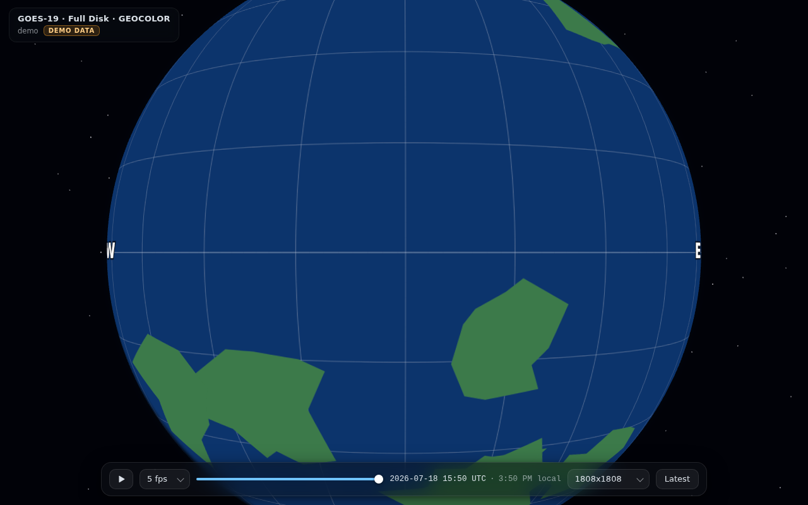

# GOES-19 Globe Viewer

An interactive 3D globe that renders live NOAA GOES-19 (GOES-East) ABI Full
Disk **GEOCOLOR** satellite imagery from the
[NOAA STAR CDN](https://cdn.star.nesdis.noaa.gov/GOES19/ABI/FD/GEOCOLOR/),
with a timeline for scrubbing through the last few days of imagery at
10-minute steps — watch the day/night terminator sweep across the planet,
storms spin, and city lights come out.



*(shown in offline demo mode; with a network connection the globe shows real
GEOCOLOR imagery)*

## Run it

```sh
cd noaa-globe-viewer
python3 serve.py          # then open http://localhost:8000/
```

`serve.py` (Python stdlib only, no dependencies) serves the app and proxies +
caches CDN requests under `.cache/`, so scrubbing the timeline is fast and
repeat frames cost no bandwidth. Any other static file server (or GitHub
Pages) also works — the app then talks to the NOAA CDN directly, which sends
open CORS headers.

No build step, no npm install: plain ES modules with a vendored copy of
three.js.

## Controls

| Control | Action |
|---|---|
| Drag / scroll on the globe | Rotate / zoom (touch works too) |
| Time slider | Scrub through every available frame (10-min cadence) |
| ▶ / Space | Play/pause time-lapse; speed selector sets frames-per-second |
| ← / → | Step one frame back / forward |
| Resolution | 339 px (fast) → 10848 px (huge; heavy on bandwidth/GPU) |
| Latest | Re-check the CDN and jump to the newest frame |

## Demo mode

Open `http://localhost:8000/?demo=1` to run fully offline with synthetic
imagery (a procedurally drawn full-disk with graticule, orientation markers,
and a moving terminator). The app also drops into demo mode automatically,
with a toast, if the CDN is unreachable. The demo disk is rendered through the
same geostationary projection used by the real imagery, so it doubles as a
test pattern for the globe shader.

## How the globe mapping works

GEOCOLOR full-disk images are in the GOES-R ABI *fixed grid* — a geostationary
perspective projection as seen from 35,786 km above 75.2°W. The fragment
shader in `js/globe.js` inverts this per pixel: sphere position → geodetic
lat/lon → satellite-relative scan angles (GOES-R Product User's Guide, L1b
vol. 3 formulas, GRS80 ellipsoid) → image UV. Points beyond the horizon from
the satellite fail the visibility test and render as a dark hemisphere with a
faint graticule — GOES-East never sees that side of Earth.

Because GEOCOLOR composites true color by day and multispectral IR with a
static city-lights layer by night, scrubbing time is what changes the look of
the disk — there is one image per moment, not per lighting condition.

## Layout

```
index.html, css/style.css, js/ui.js   UI shell (slider, playback, toasts)
js/data.js                            CDN listing parser, timestamps, demo data
js/globe.js                           three.js scene + projection shader
js/app.js                             wiring
serve.py                              static server + caching CDN proxy
vendor/                               three.js (pinned, vendored)
SPEC.md                               build spec the modules were written to
```

Imagery courtesy of NOAA/NESDIS/STAR. Not an official NOAA product.
